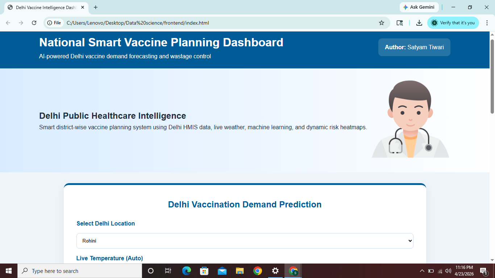
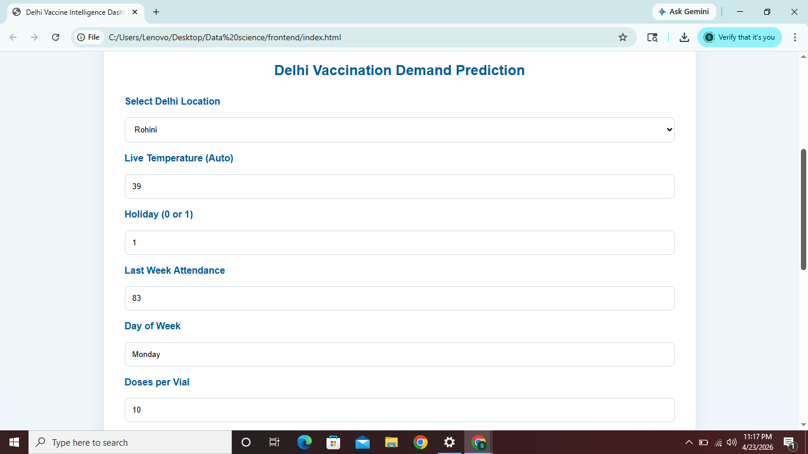
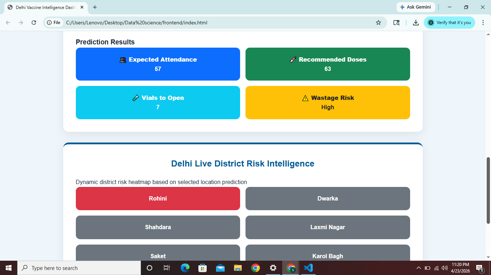

# 💉 Delhi Vaccine Intelligence Dashboard

  
  
  

**AI-powered district-wise vaccine demand forecasting and wastage risk optimization system for Delhi public healthcare centers.**

A **Data Science + GovTech healthcare intelligence platform** that leverages Machine Learning and real-world healthcare data to support smart vaccination planning and reduce wastage.

---

## 📌 Problem Statement

Vaccine sessions in public healthcare centers often face **dose wastage due to incorrect vial opening decisions**.

In Delhi, attendance varies due to:

* District-level differences
* Weather conditions 🌡️
* Holidays 📅
* Historical turnout trends 📊
* Local healthcare demand

👉 This system helps predict attendance **before the session starts**, enabling better planning and reduced wastage.

---

## 🎯 Objectives

* 📍 Forecast district-level vaccine attendance
* 💉 Optimize dose and vial usage
* 📊 Use HMIS historical data
* 🌦️ Integrate live weather data
* 🗺️ Visualize risk via heatmaps
* 🏥 Provide a decision-support dashboard

---

## 🧠 Machine Learning Models

### 🌲 Random Forest Regressor

Used for **attendance prediction**

**Inputs:**

* Temperature
* Holiday flag
* Last week attendance
* Day of week

**Output:**

* Expected attendance

---

### 📉 Logistic Regression

Used for **wastage risk classification**

**Classes:**

* Low
* Medium
* High

**Inputs:**

* Temperature
* Holiday
* Last week attendance
* Predicted attendance

---

## 📊 Dataset

### ✅ Government Dataset

* Delhi HMIS Sub-District Healthcare Data
* Cleaned and transformed for ML usage
* District trend features extracted

### ➕ Additional Inputs

* Live weather API (Open-Meteo)
* District priors
* Manual override support

---

## 🏗️ Project Structure

DATA SCIENCE/
│
├── backend/
│   ├── app.py
│   ├── model_train.py
│   ├── clean_delhi_data.py
│   └── models/
│
├── frontend/
│   ├── index.html
│   ├── style.css
│   └── script.js
│
├── images/
│   ├── dashboard.png
│   ├── prediction.png
│   ├── result.png
│
├── dataset/
└── requirements.txt

---

## 🌐 Key Features

* 📍 District-wise prediction system
* 🌡️ Live temperature auto-fill
* ✍️ Manual input override
* 📊 Interactive analytics dashboard
* 🗺️ Dynamic district risk heatmap
* 💉 Dose & vial recommendation engine
* 🏥 Government-style UI
* ⚡ Lightweight and portable

---

## 🚀 How to Run

### 1. Install dependencies

pip install -r requirements.txt

### 2. Run backend

cd backend
python app.py

### 3. Open frontend

Open in browser:
frontend/index.html

---

## 🔄 Workflow

1. Select district
2. Temperature auto-fetches
3. Enter attendance data
4. Model predicts attendance
5. Risk classification generated
6. Dose recommendation calculated
7. Heatmap updates dynamically

---

## 🏆 Use Cases

* Public Health Centers (PHCs)
* Immunization officers
* Vaccine campaign planning
* Mission Indradhanush
* School vaccination drives
* Weather-aware forecasting
* Public health logistics optimization

---

## 🔮 Future Scope

* District trend analytics
* Cost-saving insights
* Vaccine-type forecasting
* GIS-based mapping
* Cloud deployment (Streamlit/AWS)
* CoWIN / HMIS integration
* Demand anomaly alerts

---

## 👨‍💻 Author

**Satyam Tiwari**
Data Science • Healthcare AI • GovTech Innovation

---

## 🌟 Vision

To transform vaccine planning from **manual estimation → AI-driven intelligence**, improving efficiency, reducing wastage, and strengthening public healthcare systems.

---

